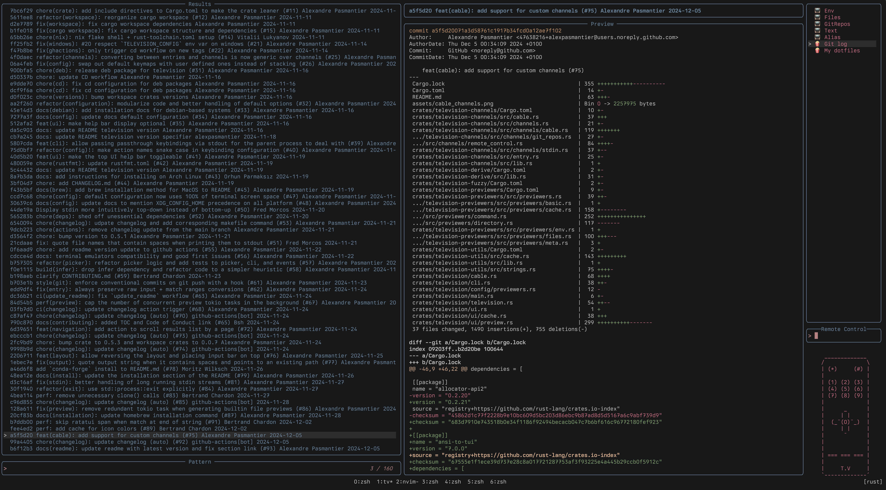

## 📺 Built-in Channels
The following built-in channels are currently available:
- `files`: search through files in a directory tree.
- `text`: search through textual content in a directory tree.
- `gitrepos`: search through git repositories anywhere on the file system.
- `env`: search through environment variables and their values.
- `alias`: search through shell aliases and their values.
- `stdin`: search through lines of text from stdin.

## 🍿 Cable channels
*Tired of broadcast television? Want to watch your favorite shows on demand? `television` has you covered with cable channels. Cable channels are channels that are not built-in to `television` but are instead provided by the community.*

You can find a list of cable channels ideas [on the wiki](https://github.com/alexpasmantier/television/wiki/Cable-channels).

### Installing cable channels
Installing cable channels is as simple as creating provider files in your configuration folder.

A provider file is a `*channels.toml` file that contains cable channel prototypes defined as follows:

**my-custom-channels.toml**
```toml
[[cable_channel]]
name = "git-log"
source_command = 'git log --oneline --date=short --pretty="format:%h %s %an %cd" "$@"'
preview_command = 'git show -p --stat --pretty=fuller --color=always {0}'

[[cable_channel]]
name = "my-dotfiles"
source_command = 'fd -t f . $HOME/.config'
preview_command = 'bat -n --color=always {0}'
```

This would add two new cable channels to `television` available:
- using the remote control mode
- through the cli (e.g. `tv git-log`, `tv my-dotfiles`)



<details>

  <summary>Deciding which part of the source command output to pass to the previewer:</summary>

  By default, each line of the source command can be passed to the previewer using `{}`. 

  If you wish to pass only a part of the output to the previewer, you may do so by specifying the `preview_delimiter` to use as a separator and refering to the desired part using the corresponding index.

  **Example:**
  ```toml
  [[cable_channel]]
  name = "Disney channel"
  source_command = 'echo "one:two:three:four" && echo "five:six:seven:eight"'
  preview_command = 'echo {2}'
  preview_delimiter = ':'
  # which will pass "three" and "seven" to the preview command
  ```

</details>
